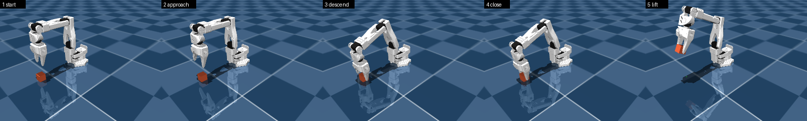
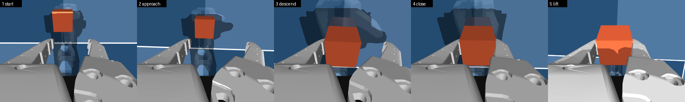

# benchmarks — measurements, and what they decided

> **한글 요약.** 여기 있는 숫자는 참고용이 아니라 **판정용**입니다. v0.1은 "레코더가
> 제어 루프를 느리게 만들면 폐기"라는 조건을 달고 있어서, 주장하지 않고 측정했습니다.
>
> 결론 세 가지입니다. **기록 자체는 예산의 0.4%로 사실상 공짜**입니다. **루프 안에서
> 카메라를 렌더하면 199%** 로 성립하지 않지만, 카메라를 별도 클럭으로 빼면 **2.5%** 가
> 되어 해결됩니다. 다만 그 과정에서 **아직 해결되지 않은 트레이드오프**가 드러났습니다.
> 시뮬이 실시간보다 60배 빨라서 카메라가 못 따라가고, 300스텝에 프레임이 3장만 나옵니다.
> 카메라를 쓰는 수집은 루프 속도를 실시간에 가깝게 늦추거나, 렌더 속도에 묶이는 것을
> 받아들여야 합니다.
>
> 무엇을 측정하는지 글로만 설명하면 알기 어려워서, **0번 절에 실제 장면을 렌더링해
> 넣었습니다.** 팔이 큐브를 집어 드는 5단계를 전체 시점과 손목 카메라 시점으로 각각
> 담았습니다. 그림이자 동시에 테스트입니다 — 마지막에 큐브 높이가 skill.yaml의 성공
> 기준(0.1m)을 넘는지 검사하고 못 넘으면 종료 코드 1을 냅니다.

A measurement here exists because a decision hangs on it. Anything measured out of
curiosity belongs in a commit message, not in this directory.

Every number below was produced on CPU with no GPU and no hardware, which is the same
constraint `CONTRIBUTING.md` puts on the test suite. If a benchmark needs more than a
laptop, its result cannot be reproduced by whoever has to question it later.

---

## 0. What is actually being measured

```bash
python benchmarks/capture_grasp.py
```

Every number on this page comes from the same scene: an SO-ARM100 and a 30 mm cube. Rather
than describe it, here it is — a scripted pick-up, five stages, rendered from the scene
camera.



And the same five stages from the wrist camera, which is what a policy would actually see:



**The jaws taking up the lower third of the wrist view is not a framing mistake.** A real
wrist camera sees its own gripper too, and that is useful — where the fingers are relative
to the object is most of what the view is for. What matters is that the cube stays centred
and grows as the arm descends, which it does.

### This is a test, not an illustration

The script ends by checking the cube's height against `cube_height_above: 0.1`, the success
condition in `skills/grasp/cube-sim/skill.yaml`, and exits non-zero if it is not met.

```
1 start    cube z = 0.0150 m
2 approach cube z = 0.0150 m
3 descend  cube z = 0.0150 m
4 close    cube z = 0.0150 m
5 lift     cube z = 0.1523 m
PASS: cube lifted to 0.1523 m, above the 0.1 m success height in skill.yaml.
```

So it answers a question that has to be settled before any policy is trained: **can this
body do this task at all?** If the jaw gap were too narrow for a 30 mm cube, the friction
too low to hold it, the reach too short, or the camera aimed at nothing, this fails —
loudly, with an exit code, rather than producing a plausible picture of a robot missing.

No policy is involved. Joint targets come from damped least-squares inverse kinematics
against the grasp point measured in section 2, so the claim is about the body. Whether a
*policy* can do it is what v0.3 exists to answer, and this is the baseline it will be
measured against.

The stage poses are hardcoded so the images are reproducible, and re-solved on every run
and compared: if the scene moves the cube or the arm changes, the script warns rather than
quietly rendering a near miss.

---

## 1. Recorder overhead — the v0.1 kill condition

```bash
python benchmarks/recorder_overhead.py            # 300 steps at 100Hz
python benchmarks/recorder_overhead.py --steps 1000 --control-hz 50
```

`docs/roadmap.md` states the condition plainly:

> **Kills the milestone:** the recorder measurably slows the control loop. If recording is
> a cost, it will be switched off, and decision 1 fails.

**Setup.** One control step is `apply` + `observe` — what the scheduler does every tick —
optionally followed by `record`. MuJoCo driver, SO-ARM100 cube scene, 100 Hz control, so
the budget per step is 10 ms. The wrist camera renders at 240×320, deliberately small:
the question is whether rendering fits at all, and a small frame is the most favourable
case available.

**Result** (300 steps, all times in milliseconds):

| | mean | p50 | p99 | of budget | frames |
| --- | --- | --- | --- | --- | --- |
| recorder off | 0.105 | 0.103 | 0.138 | 1.0% | — |
| recorder on, no camera | 0.146 | 0.134 | 0.413 | 1.5% | — |
| + wrist render, inline | 19.882 | 19.281 | 30.949 | **198.8%** | — |
| + wrist render, 30 Hz thread | 0.352 | 0.172 | 4.156 | 3.5% | 3 |

Overhead from recording alone: **+0.041 ms**, well under half a percent of the control
period, and stable across runs (+0.025, +0.027, +0.031, +0.041 ms measured on different
days). Overhead from rendering: **+19.8 ms inline, +0.247 ms on its own clock.**

### What this decides

**Recording is free, so design decision 1 holds.** The argument that a recorder which can
be switched off will be switched off does not apply, because there is nothing to gain by
switching it off. `services/recorder.py` keeps the hot path free by appending to in-memory
buffers only: LeRobot's writer batches and encodes on `save_episode`, and the DuckDB
sidecar is written once per episode. Nothing touches the disk at control rate.

**Rendering inline does not fit, and cannot be optimised into fitting.** 19.9 ms against a
10 ms budget, p99 at 31 ms. Halving the frame size does not recover a factor of two.

That was a finding about the loop rather than about the recorder. On a real robot a camera
arrives asynchronously at ~30 fps and never blocks control; rendering inline was the wrong
model of a camera. So `drivers/mujoco.py` grew `render_hz`, which puts the camera on its
own thread with its own `MjData` and `Renderer`, fed by a locked copy of `qpos`/`qvel`
that the control loop publishes once per step. **That took the render cost from +19.8 ms
to +0.247 ms — the loop is free of it.**

**Two things had to be fixed before that number was real.** Both are worth knowing.

*Writing images is a separate cost from producing them.* Once rendering moved off the
loop, `add_frame` became the bottleneck at +4.2 ms per step, because LeRobot encodes and
writes frames on the calling thread by default. `LeRobotDataset.create` takes
`image_writer_threads` for exactly this:

| writer threads | mean per step |
| --- | --- |
| 0 (synchronous) | 4.166 ms |
| **4** | **0.352 ms** |
| 8 | 0.533 ms |

Four is what `Recorder` now uses per camera. Eight measured worse than four, so this is
not a knob to turn up.

*A camera thread does not run at the rate you ask for.* Measured directly: `render_hz=30`
produces 20 Hz, `render_hz=10` produces 8 Hz. The renderer takes ~16 ms, and Windows
timers have a 15.6 ms default resolution, so the remainder of each period rounds up. The
rate is a ceiling, not a promise.

### The trade-off this exposes, which is not solved

Look at the last column: **3 frames across 300 control steps.**

That is not a bug. Simulation steps about sixty times faster than real time, while the
camera runs on wall-clock time exactly as a real one does. A 30 Hz camera against a loop
that finishes 300 steps in 0.18 s genuinely has almost nothing new to show. An episode
recorded that way pairs a moving arm with a nearly static video, which is worse than
useless for training — it teaches that the image does not predict the action.

There is no clever fix, only a choice:

- **Pace the control loop toward real time while recording.** This is what a robot does
  anyway, and it makes the frame rate correct. It gives up simulation speed.
- **Accept that camera-bearing collection is render-bound.** At ~16 ms per frame, one
  simulated second of 30 fps video costs about half a second of rendering, so collection
  runs at best around 1.5x real time regardless of how fast the physics is.

`MujocoDriver.frames_rendered` exists so a caller can tell which regime a run was in.
Comparing it against the step count answers "how many of my recorded frames are actually
different images?", and the answer is frequently not what the caller expects.

**A number for v0.2.** SmolVLA defaults to a 50-step action chunk. At 100 Hz that is 0.5 s
of intent, which is also about 15 camera frames at 30 fps. The camera clock and the
deliberation clock are within a factor of two of each other, and neither is anywhere near
the control clock. Three tiers, not two.

---

## 2. Driver conformance — measured, not asserted

Not a timing benchmark; a set of facts about the body that the numbers above depend on.
Reproduced by `benchmarks/recorder_overhead.py` implicitly, and checked directly while
implementing `drivers/mujoco.py`.

**SO-ARM100 geometry**, measured from the loaded model rather than read off a datasheet:

| Quantity | Measured | Used for |
| --- | --- | --- |
| Actuators | 6 (5 arm joints + `Jaw`) | `Capability.dof` reports 5; the jaw is `Action.gripper` |
| Jaw gap, fully closed | 16 mm | lower bound on graspable object size |
| Jaw gap, fully open | 104 mm | upper bound |
| Grasp point, `Fixed_Jaw` frame | (-0.0087, -0.0823, 0) m | where the wrist camera is aimed |
| Max horizontal reach at table height | 0.377 m | where the cube can be spawned |

The 30 mm cube and its spawn at 0.25 m along −y both follow from these, rather than from
a guess that happened to work.

**Timing conformance.** 50 control steps at 100 Hz advance simulation time to exactly
0.500 s, so the driver's substep arithmetic — 5 physics steps of 2 ms per control step —
holds. A joint commanded to +0.5 rad reaches 0.499 rad. Gripper commanded fully open then
fully closed reads 1.000 then 0.000.

**Stability.** After 1.0 s of settling with no command, the cube holds z = 0.0150 m: it
rests on the floor rather than sinking through it or being launched by it. This is the
check that catches a bad `solimp`/`solref` before it becomes a mysterious training signal.

---

## 3. Round trip — recorder into human driver

The recorder and the replay driver verify each other, which is cheaper than trusting
either alone.

Wrote two episodes with `services/recorder.py`, then replayed them through
`drivers/human.py`:

| | Written | Replayed |
| --- | --- | --- |
| Episode 0 | 40 frames | 40 frames |
| Episode 1 | 15 frames | 15 frames |
| Gripper action | ramped 1.00 → 0.03 | 1.00 → 0.03 |

`Capability` was reconstructed from the dataset schema alone as `dof=5`, parallel gripper,
100 Hz, cameras `(wrist,)`, `readonly=True`. Rendered frames come back as `(240, 320, 3)`
`uint8` — the same shape and dtype the MuJoCo driver produces, so a consumer does not
branch on body type.

**What this decides.** Design decision 3 is testable rather than asserted: a simulated body
and a recorded body are interchangeable through the same HAL. The sidecar held 55 rows
across 2 episodes with 5 intervention frames, so confidence and intervention survive the
round trip too.

---

## 4. Environment findings worth not rediscovering

Not benchmarks, but the cost of finding them again is real.

- **MuJoCo cannot open non-ASCII absolute paths on Windows.** The file is readable; only
  MuJoCo's byte-oriented path API fails, reporting a path full of replacement characters.
  8.3 short paths do not help — `GetShortPathNameW` only shortens components over eight
  characters, so a short non-ASCII directory survives. `drivers/mujoco.py` loads with the
  working directory moved to the scene folder instead.
- **cp949 consoles cannot print an em dash.** A Windows console in a Korean locale raises
  `UnicodeEncodeError` mid-print. Benchmark output is plain ASCII for that reason — a
  script that crashes while printing its own conclusion is worse than one that never ran.
- **`pip install lerobot` cannot open a dataset.** `LeRobotDataset` needs lerobot's
  `dataset` extra, which pins `av>=15,<16`; a bare `pip install av` resolves to 18.x and
  fails with `module 'av' has no attribute 'option'`. There is no `torchcodec` wheel for
  Windows, so LeRobot falls back to pyav with a warning.

---

## Adding a benchmark

Two rules, both about keeping this directory small.

1. **Name the decision it settles.** If the result would not change what anyone does, it
   is a commit message, not a benchmark.
2. **Make it exit non-zero when the answer is bad.** `recorder_overhead.py` fails if
   recording alone exceeds a tenth of the control period. A benchmark that only prints is
   a benchmark nobody runs twice.
